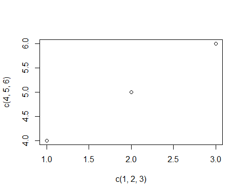
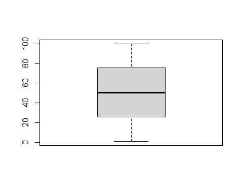
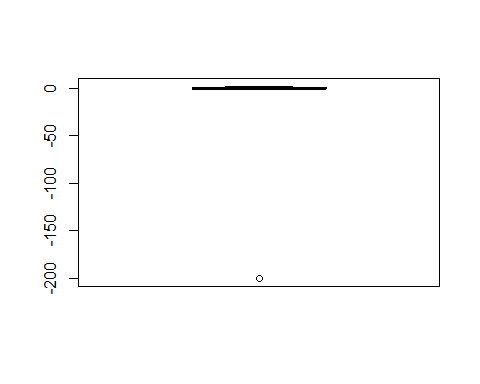
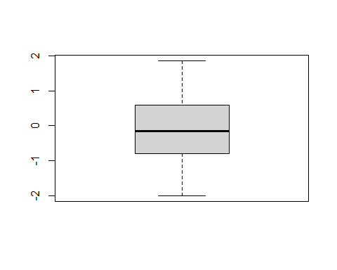
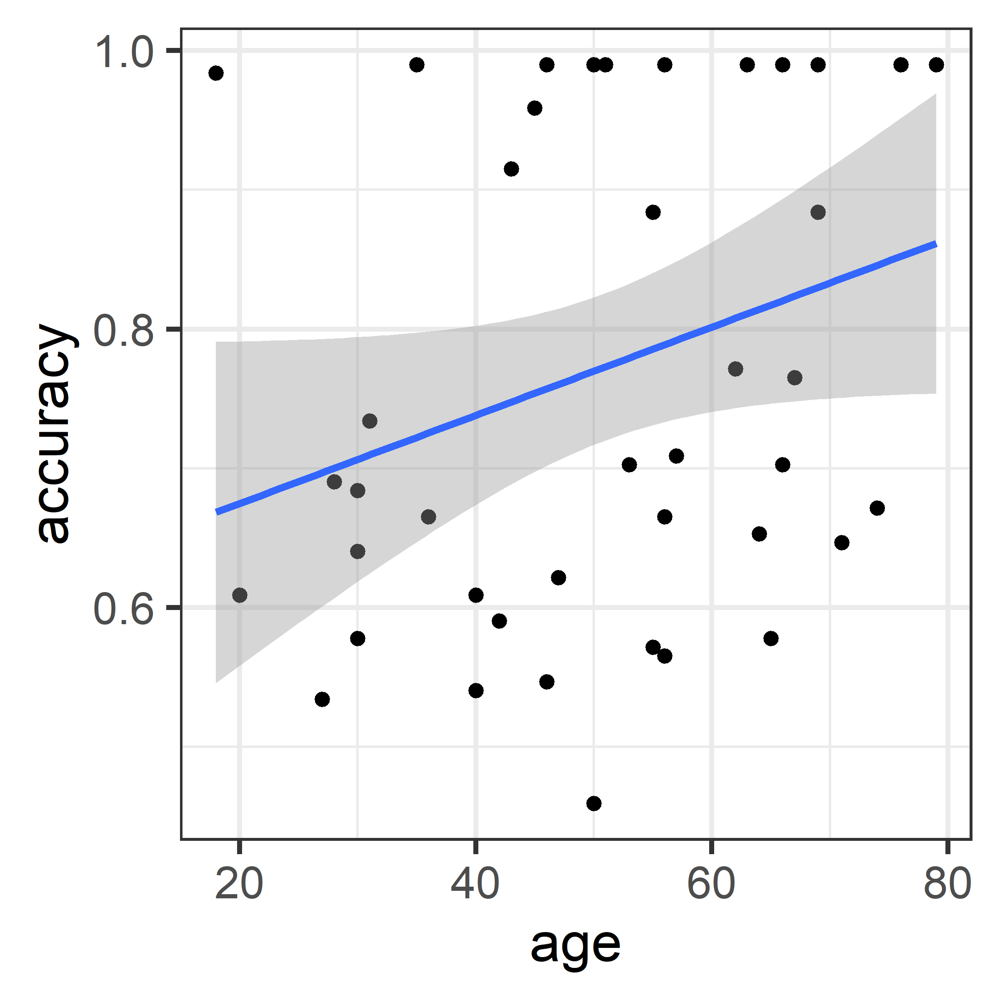
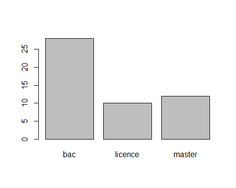
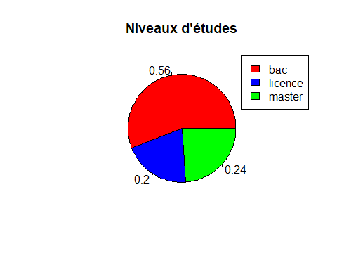
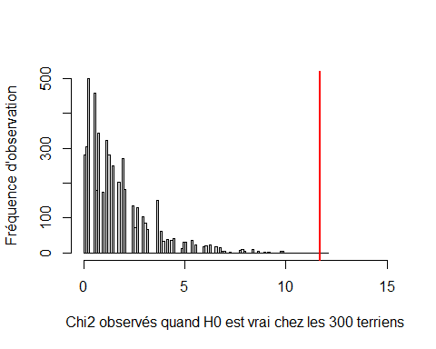
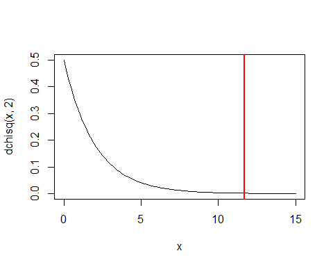

# Lancer une commande

```r
5+5
```

```
## [1] 10
```

```r
5*2
```

```
## [1] 10
```

```r
20/2
```

```
## [1] 10
```

```r
sqrt(40)
```

```
## [1] 6.324555
```

```r
2^4
```

```
## [1] 16
```

# Fonction

## Exemple de fonction

```r
# function with various descriptive statistics
fxdescribe = function(x){
   # x has to be a continuous variable
  c(obs          = length(x),
    missing      = sum(is.na(x),na.rm=T),
    min          = min(x,na.rm=T),
    max          = max(x,na.rm=T),
    median       = median(x,na.rm=T),
    q1           = quantile(x,na.rm=T,c(.25)),
    q3           = quantile(x,na.rm=T,c(.75)),
    mean         = mean(x,na.rm=T),
    sd           = sd(x,na.rm=T),
    `95lci`      = mean(x,na.rm=T)-(sd(x,na.rm = T)*1.96/sqrt(length(x))),
    `95hci`      = mean(x,na.rm=T)+(sd(x,na.rm = T)*1.96/sqrt(length(x)))
    )
}
# e.g. = 
fxdescribe(c(NA,NA,2,5,6))
```

```
##      obs  missing      min      max   median   q1.25%   q3.75%     mean 
## 5.000000 2.000000 2.000000 6.000000 5.000000 3.500000 5.500000 4.333333 
##       sd    95lci    95hci 
## 2.081666 2.508673 6.157994
```

## Exercice 1

```r
seq(from = 0, to = 100, by = 20)
```

```
## [1]   0  20  40  60  80 100
```

```r
c(1:10)*2
```

```
##  [1]  2  4  6  8 10 12 14 16 18 20
```

```r
rep(x = c(1,2,3), times = 3)
```

```
## [1] 1 2 3 1 2 3 1 2 3
```

```r
rep(x = c(1,2,3), times = 3, each = 3)
```

```
##  [1] 1 1 1 2 2 2 3 3 3 1 1 1 2 2 2 3 3 3 1 1 1 2 2 2 3 3 3
```

```r
sum(1:3)
```

```
## [1] 6
```

```r
sum(is.na(c(NA,NA,1,NA)))
```

```
## [1] 3
```

```r
plot(x = c(1,2,3), y = c(4,5,6))
```

<!-- -->

```r
boxplot(1:100)
```

<!-- -->

```r
summary(c(1,8,9,7))
```

```
##    Min. 1st Qu.  Median    Mean 3rd Qu.    Max. 
##    1.00    5.50    7.50    6.25    8.25    9.00
```

# Installer un paquet

```r
install.packages("psych")   # installe le paquet
library("psych")            # charge le paquet et ses fonctions
```

# Création d'objet

```r
objet  <- "objet"
objet  = 4
1objet <- 4 # erreur
```

```
## Error: <text>:3:2: unexpected symbol
## 2: objet  = 4
## 3: 1objet
##     ^
```


```r
vache   <- c("spassky", "karpov", "kasparov", "topalov") # "c()" signifie "concaténer"
couleur <- c("noire", "noire", "marron", "blanche")
poids   <- c(900,600,700,650)

table(couleur)
```

```
## couleur
## blanche  marron   noire 
##       1       1       2
```

```r
summary(poids)
```

```
##    Min. 1st Qu.  Median    Mean 3rd Qu.    Max. 
##   600.0   637.5   675.0   712.5   750.0   900.0
```

# Type d'objet

## Objet simple

```r
objet1 <- 10
objet2 <- "Michel est dans le garage"

objet1
```

```
## [1] 10
```

```r
objet2
```

```
## [1] "Michel est dans le garage"
```


## Vecteur

```r
vache   <- c("spassky", "karpov", "kasparov", "topalov")
str(vache) # characters (lettres)
```

```
##  chr [1:4] "spassky" "karpov" "kasparov" "topalov"
```

```r
poids   <- c(900,600,700,650)
str(poids) # integers (chiffres ronds)
```

```
##  num [1:4] 900 600 700 650
```

```r
# les données doivent être du même type 
vache_poids <- c(vache, poids)
str(vache_poids)
```

```
##  chr [1:8] "spassky" "karpov" "kasparov" "topalov" "900" "600" "700" "650"
```

```r
# possible de changer la nature d'un vecteur
(poids <- as.character(poids))
```

```
## [1] "900" "600" "700" "650"
```

```r
(poids <- as.numeric(poids))
```

```
## [1] 900 600 700 650
```

## Facteur

```r
facteur_vache <- factor(vache)
facteur_vache
```

```
## [1] spassky  karpov   kasparov topalov 
## Levels: karpov kasparov spassky topalov
```

```r
# NB : les niveaux sont rangés automatiquement par ordre alphabétique

# possibilité de ré-ordonner ces niveaux et de les renommer
facteur_vache <- factor(vache, levels = c("spassky","kasparov","karpov","topalov"),
                       labels = c("Spassky","Kasparov","Karpov","Topalov"))
facteur_vache
```

```
## [1] Spassky  Karpov   Kasparov Topalov 
## Levels: Spassky Kasparov Karpov Topalov
```

## Matrice

```r
vache   <- c("spassky", "karpov", "kasparov", "topalov")
couleur <- c("noire", "noire", "marron", "blanche")

# on combine les deux vecteurs avec la fonction cbind() 
# qui veut dire : column bind (combiner colonnes)
MAT <- cbind(vache,couleur)
MAT
```

```
##      vache      couleur  
## [1,] "spassky"  "noire"  
## [2,] "karpov"   "noire"  
## [3,] "kasparov" "marron" 
## [4,] "topalov"  "blanche"
```

## DataFrame

```r
DF <- data.frame(vache,couleur,poids)
DF
```

```
##      vache couleur poids
## 1  spassky   noire   900
## 2   karpov   noire   600
## 3 kasparov  marron   700
## 4  topalov blanche   650
```

## Liste

```r
LS <- list(vache, MAT, DF)
LS
```

```
## [[1]]
## [1] "spassky"  "karpov"   "kasparov" "topalov" 
## 
## [[2]]
##      vache      couleur  
## [1,] "spassky"  "noire"  
## [2,] "karpov"   "noire"  
## [3,] "kasparov" "marron" 
## [4,] "topalov"  "blanche"
## 
## [[3]]
##      vache couleur poids
## 1  spassky   noire   900
## 2   karpov   noire   600
## 3 kasparov  marron   700
## 4  topalov blanche   650
```

### Aller plus loin : exemple de loupe

```r
LS <- list() # liste vide
#
for (VACHE in DF[,"vache"]) {
  LS[[VACHE]] <- DF[DF$vache == VACHE,]
}
LS
```

```
## $spassky
##     vache couleur poids
## 1 spassky   noire   900
## 
## $karpov
##    vache couleur poids
## 2 karpov   noire   600
## 
## $kasparov
##      vache couleur poids
## 3 kasparov  marron   700
## 
## $topalov
##     vache couleur poids
## 4 topalov blanche   650
```


# Exercice 3

```r
# exemple :
# animaux <- c("koala", "chat", "poule", "serpent")
# pays    <- c("chine", "japon", "irlande", "canada")
# poids   <- c(10,4,3,1)
# (MAT <- matrix(cbind(animaux,pays)))
# (DF  <- data.frame(animaux, pays, poids))
# (LS   <- list(animaux, DF))
```

# Importation des données

Connaître son répertoire de travail :

```r
getwd()
```

```
## [1] "C:/Users/remi.DESKTOP-UI81QOM/Desktop/COURS v14chu/6. Stat R analyse linguistique 23-24/COURS"
```

## Importer le DF *meta_bands*


```r
DF <- read.csv("metal_bands.csv", header = T, sep = ";", dec = ".")
head(DF, n = 4)
```

```
##   ï..Territory Bands Population Happiness
## 1  Afghanistan     2   37466414     2.404
## 2      Albania     7    3088385     5.199
## 3      Algeria    16   43576691     5.122
## 4      Andorra     2      85645        NA
```

```r
str(DF) # TOUJOURS VERIFIER LE FORMAT DES VARIABLES !
```

```
## 'data.frame':	174 obs. of  4 variables:
##  $ ï..Territory: chr  "Afghanistan" "Albania" "Algeria" "Andorra" ...
##  $ Bands       : int  2 7 16 2 8 1907 19 1545 664 9 ...
##  $ Population  : int  37466414 3088385 43576691 85645 33642646 45864941 3011609 25809973 8884864 10282283 ...
##  $ Happiness   : num  2.4 5.2 5.12 NA NA ...
```

```r
# View(DF)
# adresse implicite
paste0(getwd(),"/meta_bands.csv")
```

```
## [1] "C:/Users/remi.DESKTOP-UI81QOM/Desktop/COURS v14chu/6. Stat R analyse linguistique 23-24/COURS/meta_bands.csv"
```

```r
# importation avec excel
# install.packages("readxl")
library(readxl)
```

```
## Warning: package 'readxl' was built under R version 4.0.5
```

```r
DF <- readxl::read_xlsx("metal_bands.xlsx")
head(DF)
```

```
## # A tibble: 6 x 4
##   Territory   Bands Population Happiness
##   <chr>       <dbl>      <dbl>     <dbl>
## 1 Afghanistan     2   37466414      2.40
## 2 Albania         7    3088385      5.20
## 3 Algeria        16   43576691      5.12
## 4 Andorra         2      85645     NA   
## 5 Angola          8   33642646     NA   
## 6 Argentina    1907   45864941      5.97
```

# Exercice 4

Importez et inspectez les fichiers "reading_skills" numérotés de 1 à 4, disponibles sur https://github.com/lafitter/M2-Science-du-Langage

Attention aux séparateurs et décimales…

Une erreur d'importation se sera sûrement glissée dans reading_skills3 ; laquelle ? et pourquoi ? (indice : rappelez-vous la définition de "vecteur")


```r
DF = read.csv("reading_skills1.csv",sep=";", dec = ",")
head(DF);str(DF)
```

```
##   sujet age accuracy dyslexia     iq
## 1     1  69  0.88386       no  0.827
## 2     2  67  0.76524       no  0.590
## 3     3  43  0.91508       no  0.471
## 4     4  18  0.98376       no  1.144
## 5     5  55  0.88386       no -0.676
## 6     6  57  0.70905       no -0.795
```

```
## 'data.frame':	45 obs. of  5 variables:
##  $ sujet   : int  1 2 3 4 5 6 7 8 9 10 ...
##  $ age     : int  69 67 43 18 55 57 62 50 79 69 ...
##  $ accuracy: num  0.884 0.765 0.915 0.984 0.884 ...
##  $ dyslexia: chr  "no" "no" "no" "no" ...
##  $ iq      : num  0.827 0.59 0.471 1.144 -0.676 ...
```

```r
DF = read.csv("reading_skills2.csv",sep=";")
head(DF);str(DF)
```

```
##   sujet age accuracy dyslexia     iq
## 1     1  69  0.88386       no  0.827
## 2     2  67  0.76524       no  0.590
## 3     3  43  0.91508       no  0.471
## 4     4  18  0.98376       no  1.144
## 5     5  55  0.88386       no -0.676
## 6     6  57  0.70905       no -0.795
```

```
## 'data.frame':	44 obs. of  5 variables:
##  $ sujet   : int  1 2 3 4 5 6 7 8 9 10 ...
##  $ age     : int  69 67 43 18 55 57 62 50 79 69 ...
##  $ accuracy: num  0.884 0.765 0.915 0.984 0.884 ...
##  $ dyslexia: chr  "no" "no" "no" "no" ...
##  $ iq      : num  0.827 0.59 0.471 1.144 -0.676 ...
```

```r
DF = readxl::read_xlsx("reading_skills3.xlsx")
head(DF);str(DF)
```

```
## # A tibble: 6 x 5
##   sujet   age accuracy dyslexia     iq
##   <dbl> <dbl>    <dbl> <chr>     <dbl>
## 1     1    69    0.884 no        0.827
## 2     2    67    0.765 no        0.59 
## 3     3    43    0.915 no        0.471
## 4     4    18    0.984 no        1.14 
## 5     5    55    0.884 no       -0.676
## 6     6    57    0.709 no       -0.795
```

```
## tibble [44 x 5] (S3: tbl_df/tbl/data.frame)
##  $ sujet   : num [1:44] 1 2 3 4 5 6 7 8 9 10 ...
##  $ age     : num [1:44] 69 67 43 18 55 57 62 50 79 69 ...
##  $ accuracy: num [1:44] 0.884 0.765 0.915 0.984 0.884 ...
##  $ dyslexia: chr [1:44] "no" "no" "no" "no" ...
##  $ iq      : num [1:44] 0.827 0.59 0.471 1.144 -0.676 ...
```

## Importation quand une variable à un format "hybride"

```r
DF = read.csv("reading_skills4.csv",sep=";")
head(DF);str(DF)
```

```
##   sujet age accuracy dyslexia      iq
## 1     1  69  0.88386       no no data
## 2     2  67  0.76524       no    0.59
## 3     3  43  0.91508       no    <NA>
## 4     4  18  0.98376       no   1.144
## 5     5  55  0.88386       no  -0.676
## 6     6  57  0.70905       no  -0.795
```

```
## 'data.frame':	44 obs. of  5 variables:
##  $ sujet   : int  1 2 3 4 5 6 7 8 9 10 ...
##  $ age     : int  69 67 43 18 55 57 62 50 79 69 ...
##  $ accuracy: num  0.884 0.765 0.915 0.984 0.884 ...
##  $ dyslexia: chr  "no" "no" "no" "no" ...
##  $ iq      : chr  "no data" "0.59" NA "1.144" ...
```

```r
# le format de iq est caractère

DF = read.csv("reading_skills4.csv",sep=";", na.strings = c("NA","no data"))
head(DF);str(DF)
```

```
##   sujet age accuracy dyslexia     iq
## 1     1  69  0.88386       no     NA
## 2     2  67  0.76524       no  0.590
## 3     3  43  0.91508       no     NA
## 4     4  18  0.98376       no  1.144
## 5     5  55  0.88386       no -0.676
## 6     6  57  0.70905       no -0.795
```

```
## 'data.frame':	44 obs. of  5 variables:
##  $ sujet   : int  1 2 3 4 5 6 7 8 9 10 ...
##  $ age     : int  69 67 43 18 55 57 62 50 79 69 ...
##  $ accuracy: num  0.884 0.765 0.915 0.984 0.884 ...
##  $ dyslexia: chr  "no" "no" "no" "no" ...
##  $ iq      : num  NA 0.59 NA 1.144 -0.676 ...
```

```r
# le format de iq est numérique
```

# Objet et environnement

```r
# rm(list = ls()) # vide TOUT l'environnement (rm = remove)
rm(objet1)        # supprime un objet
ls()              # liste des objets
```

```
##  [1] "couleur"       "DF"            "facteur_vache" "fxdescribe"   
##  [5] "LS"            "MAT"           "objet2"        "poids"        
##  [9] "vache"         "VACHE"         "vache_poids"
```

```r
ls(".GlobalEnv")  # liste des objets (idem)
```

```
##  [1] "couleur"       "DF"            "facteur_vache" "fxdescribe"   
##  [5] "LS"            "MAT"           "objet2"        "poids"        
##  [9] "vache"         "VACHE"         "vache_poids"
```

```r
search()          # montre environnement et paquets
```

```
##  [1] ".GlobalEnv"        "package:readxl"    "package:stats"    
##  [4] "package:graphics"  "package:grDevices" "package:utils"    
##  [7] "package:datasets"  "package:methods"   "Autoloads"        
## [10] "package:base"
```

Extraire une variable du DF meta_bands

```r
DF <- read.csv("metal_bands.csv", sep =";")
Bands           # ne fonctionne pas...
```

```
## Error in eval(expr, envir, enclos): objet 'Bands' introuvable
```

```r
DF$Bands        # fonctionne !
```

```
##   [1]     2     7    16     2     8  1907    19  1545   664     9     6    65
##  [13]     3   293   666     1    NA   243    86     7  4173    15   203    NA
##  [25]     2    NA  2756    NA  2096   284  1491    NA    NA   235   248    54
##  [37]    52   964   500    31     1   470    41    96   135    NA    NA    11
##  [49]  2381    29     1    NA    NA    23  5726    NA     3  1236     6   113
##  [61]     7     2    NA    50    31   604   113   196  1601    94    12   231
##  [73]     1   165  3623    NA     2  1318     3    20    25     6    NA     5
##  [85]     6     7    83    25    NA    NA     4     7   108    38    16    NA
##  [97]   458     6    NA    51    NA     2    24    25     2     5     9    22
## [109]     1     9     1    23  1084     5   288    35    NA    NA    NA    63
## [121]  1007     2    19     1    54   174   402   257  1523   752   101     3
## [133]     9   270  3072    NA     1     3     9   285    NA    NA   173   357
## [145]   164   165   146  2002    30     2  2281   630    22    79     3    NA
## [157]   132     5    NA    25   329     2     2   715    14  3244 17557   121
## [169]     9   343    21    NA    NA     2
```

## Transformer DF en environnement

```r
attach(DF) # transforme le DF en environnement
search()
```

```
##  [1] ".GlobalEnv"        "DF"                "package:readxl"   
##  [4] "package:stats"     "package:graphics"  "package:grDevices"
##  [7] "package:utils"     "package:datasets"  "package:methods"  
## [10] "Autoloads"         "package:base"
```

```r
Bands
```

```
##   [1]     2     7    16     2     8  1907    19  1545   664     9     6    65
##  [13]     3   293   666     1    NA   243    86     7  4173    15   203    NA
##  [25]     2    NA  2756    NA  2096   284  1491    NA    NA   235   248    54
##  [37]    52   964   500    31     1   470    41    96   135    NA    NA    11
##  [49]  2381    29     1    NA    NA    23  5726    NA     3  1236     6   113
##  [61]     7     2    NA    50    31   604   113   196  1601    94    12   231
##  [73]     1   165  3623    NA     2  1318     3    20    25     6    NA     5
##  [85]     6     7    83    25    NA    NA     4     7   108    38    16    NA
##  [97]   458     6    NA    51    NA     2    24    25     2     5     9    22
## [109]     1     9     1    23  1084     5   288    35    NA    NA    NA    63
## [121]  1007     2    19     1    54   174   402   257  1523   752   101     3
## [133]     9   270  3072    NA     1     3     9   285    NA    NA   173   357
## [145]   164   165   146  2002    30     2  2281   630    22    79     3    NA
## [157]   132     5    NA    25   329     2     2   715    14  3244 17557   121
## [169]     9   343    21    NA    NA     2
```

```r
detach(DF) # dé-transforme le DF en simple DF
```

## Attention aux conflits d'environnement

```r
Bands = c("megadeath", "sepultura", "mylene farmer")
attach(DF) 
```

```
## The following object is masked _by_ .GlobalEnv:
## 
##     Bands
```

```r
Bands # pas vraiment le résultat attendu
```

```
## [1] "megadeath"     "sepultura"     "mylene farmer"
```

```r
detach(DF)
rm(Bands)
```

# Coordonnées

## Vecteur

```r
vache[1]
```

```
## [1] "spassky"
```

## Dataframe

Les coordonnées d'un DF sont en 2 dimensions.


```r
head(DF)
```

```
##   ï..Territory Bands Population Happiness
## 1  Afghanistan     2   37466414     2.404
## 2      Albania     7    3088385     5.199
## 3      Algeria    16   43576691     5.122
## 4      Andorra     2      85645        NA
## 5       Angola     8   33642646        NA
## 6    Argentina  1907   45864941     5.967
```

```r
DF[2,]
```

```
##   ï..Territory Bands Population Happiness
## 2      Albania     7    3088385     5.199
```

```r
DF[,2] # renvoie un vecteur
```

```
##   [1]     2     7    16     2     8  1907    19  1545   664     9     6    65
##  [13]     3   293   666     1    NA   243    86     7  4173    15   203    NA
##  [25]     2    NA  2756    NA  2096   284  1491    NA    NA   235   248    54
##  [37]    52   964   500    31     1   470    41    96   135    NA    NA    11
##  [49]  2381    29     1    NA    NA    23  5726    NA     3  1236     6   113
##  [61]     7     2    NA    50    31   604   113   196  1601    94    12   231
##  [73]     1   165  3623    NA     2  1318     3    20    25     6    NA     5
##  [85]     6     7    83    25    NA    NA     4     7   108    38    16    NA
##  [97]   458     6    NA    51    NA     2    24    25     2     5     9    22
## [109]     1     9     1    23  1084     5   288    35    NA    NA    NA    63
## [121]  1007     2    19     1    54   174   402   257  1523   752   101     3
## [133]     9   270  3072    NA     1     3     9   285    NA    NA   173   357
## [145]   164   165   146  2002    30     2  2281   630    22    79     3    NA
## [157]   132     5    NA    25   329     2     2   715    14  3244 17557   121
## [169]     9   343    21    NA    NA     2
```

```r
DF[2]  # renvoie un DF
```

```
##     Bands
## 1       2
## 2       7
## 3      16
## 4       2
## 5       8
## 6    1907
## 7      19
## 8    1545
## 9     664
## 10      9
## 11      6
## 12     65
## 13      3
## 14    293
## 15    666
## 16      1
## 17     NA
## 18    243
## 19     86
## 20      7
## 21   4173
## 22     15
## 23    203
## 24     NA
## 25      2
## 26     NA
## 27   2756
## 28     NA
## 29   2096
## 30    284
## 31   1491
## 32     NA
## 33     NA
## 34    235
## 35    248
## 36     54
## 37     52
## 38    964
## 39    500
## 40     31
## 41      1
## 42    470
## 43     41
## 44     96
## 45    135
## 46     NA
## 47     NA
## 48     11
## 49   2381
## 50     29
## 51      1
## 52     NA
## 53     NA
## 54     23
## 55   5726
## 56     NA
## 57      3
## 58   1236
## 59      6
## 60    113
## 61      7
## 62      2
## 63     NA
## 64     50
## 65     31
## 66    604
## 67    113
## 68    196
## 69   1601
## 70     94
## 71     12
## 72    231
## 73      1
## 74    165
## 75   3623
## 76     NA
## 77      2
## 78   1318
## 79      3
## 80     20
## 81     25
## 82      6
## 83     NA
## 84      5
## 85      6
## 86      7
## 87     83
## 88     25
## 89     NA
## 90     NA
## 91      4
## 92      7
## 93    108
## 94     38
## 95     16
## 96     NA
## 97    458
## 98      6
## 99     NA
## 100    51
## 101    NA
## 102     2
## 103    24
## 104    25
## 105     2
## 106     5
## 107     9
## 108    22
## 109     1
## 110     9
## 111     1
## 112    23
## 113  1084
## 114     5
## 115   288
## 116    35
## 117    NA
## 118    NA
## 119    NA
## 120    63
## 121  1007
## 122     2
## 123    19
## 124     1
## 125    54
## 126   174
## 127   402
## 128   257
## 129  1523
## 130   752
## 131   101
## 132     3
## 133     9
## 134   270
## 135  3072
## 136    NA
## 137     1
## 138     3
## 139     9
## 140   285
## 141    NA
## 142    NA
## 143   173
## 144   357
## 145   164
## 146   165
## 147   146
## 148  2002
## 149    30
## 150     2
## 151  2281
## 152   630
## 153    22
## 154    79
## 155     3
## 156    NA
## 157   132
## 158     5
## 159    NA
## 160    25
## 161   329
## 162     2
## 163     2
## 164   715
## 165    14
## 166  3244
## 167 17557
## 168   121
## 169     9
## 170   343
## 171    21
## 172    NA
## 173    NA
## 174     2
```

```r
DF[2,2] # renvoie à une cellule précise du DF
```

```
## [1] 7
```

### Filtrage

Néanmoins ce système de coordonnées est peu pratique à manier ; on préfère spécifier des *noms* à la place de *chiffres*

Filtrages simples


```r
DF[c("Bands", "Happiness")]
DF[DF$Territory == "France","Bands"]
DF[DF$Territory %in%  c("France","Uruguay"),]
DF[!DF$Territory %in%  c("Togo","Bulgaria"),]
DF[row.names(DF) %in% c(5,87,142),]
DF[DF$Bands > 1 & !is.na(DF$Bands),]
```

Filtrages complexes


```r
DF <- readxl::read_xlsx("metal_bands.xlsx")
head(DF)
DF2 <- DF[complete.cases(DF),] # keep rows with no NA
attach(DF2)
DF2[Bands < 5 & Population > 10000000,]
DF2[Territory %in%  c("France","Germany") | Bands > 2000, ]
detach(DF2)
```

### Remplacement de données


```r
DF2 <- DF

DF2[DF2$Territory == "France","Happiness"]
```

```
## # A tibble: 1 x 1
##   Happiness
##       <dbl>
## 1      6.69
```

```r
DF2[DF2$Territory == "France","Happiness"] <- 20 # bonheur absolu ?
DF2[DF2$Territory == "France","Happiness"]
```

```
## # A tibble: 1 x 1
##   Happiness
##       <dbl>
## 1        20
```

```r
DF2$Bands[is.na(DF2$Bands)]<- 0 # remplace toutes les valeurs NA de Bands par un 0
rm(DF2)
```

### Ordonner les données


```r
head(DF[order(DF$Bands),])  # ordre croissant
```

```
## # A tibble: 6 x 4
##   Territory        Bands Population Happiness
##   <chr>            <dbl>      <dbl>     <dbl>
## 1 Belize               1     405633     NA   
## 2 East Timor           1    1413958     NA   
## 3 French Polynesia     1     297154     NA   
## 4 Isle of Man          1      90895     NA   
## 5 Mozambique           1   30888034      5.05
## 6 Namibia              1    2678191      4.46
```

```r
head(DF[order(-DF$Bands),]) # ordre décroissant
```

```
## # A tibble: 6 x 4
##   Territory      Bands Population Happiness
##   <chr>          <dbl>      <dbl>     <dbl>
## 1 United States  17557  334998398      6.98
## 2 Germany         5726   79903481      7.03
## 3 Brazil          4173  213445417      6.29
## 4 Italy           3623   62390364      6.47
## 5 United Kingdom  3244   66052076      6.94
## 6 Russia          3072  142320790      5.46
```

## Création de variables (i.e., rajouter/modifier les vecteurs d'un DF)

```r
DF2 <- DF
Happiness_rounded <- round(DF2$Happiness,0)
Happiness_rounded # Nous avons crée un vecteur, mais celui-ci est à l'extérieur du DF...
```

```
##   [1]  2  5  5 NA NA  6  5  7  7  5  7  5 NA  6  7 NA  5  6  6  3  6 NA  5  5  5
##  [26]  5  7  4  6  6  6  5  5  7  6 NA  6  7  8  6 NA  6  4  6  6  4  4 NA  8  7
##  [51] NA  5  5  5  7  5 NA  6 NA  6 NA NA  5  6  5  6  8  4  5  5  5  7 NA  7  6
##  [76]  5  6  6 NA  4  6  5  6  6  6  5  6  3  4  5  5 NA  6  7  4  4  6 NA  4  6
## [101]  4  6  6  6 NA  6  6  5  5  4  4  5  7 NA  7  6  5  5  5  5  7 NA  5  4  6
## [126]  6  6  6  6  6 NA NA NA  6  5  3 NA NA  7  6  5  4  6  6  7  5  6  6  4 NA
## [151]  7  8 NA  7  5  4  6 NA  4  5  5  5  5  5  7  7  7  6  6  5  5  4  4  3
```

```r
# nous pouvons résoudre ce problème avec cbind
head(cbind(DF2,Happiness_rounded))
```

```
##     Territory Bands Population Happiness Happiness_rounded
## 1 Afghanistan     2   37466414     2.404                 2
## 2     Albania     7    3088385     5.199                 5
## 3     Algeria    16   43576691     5.122                 5
## 4     Andorra     2      85645        NA                NA
## 5      Angola     8   33642646        NA                NA
## 6   Argentina  1907   45864941     5.967                 6
```

```r
# néanmoins il y a une solution beaucoup plus simple :
DF2$Happiness_rounded <- round(DF2$Happiness,0)
head(DF2)
```

```
## # A tibble: 6 x 5
##   Territory   Bands Population Happiness Happiness_rounded
##   <chr>       <dbl>      <dbl>     <dbl>             <dbl>
## 1 Afghanistan     2   37466414      2.40                 2
## 2 Albania         7    3088385      5.20                 5
## 3 Algeria        16   43576691      5.12                 5
## 4 Andorra         2      85645     NA                   NA
## 5 Angola          8   33642646     NA                   NA
## 6 Argentina    1907   45864941      5.97                 6
```

Attention, la nouvelle variable doit avoir le même nombre de lignes que le DF.
La seule exception est la possibilité de rajouter une constante

```r
DF2$Happiness_mean <- mean(DF2$Happiness, na.rm = T)
head(DF2)
```

```
## # A tibble: 6 x 6
##   Territory   Bands Population Happiness Happiness_rounded Happiness_mean
##   <chr>       <dbl>      <dbl>     <dbl>             <dbl>          <dbl>
## 1 Afghanistan     2   37466414      2.40                 2           5.55
## 2 Albania         7    3088385      5.20                 5           5.55
## 3 Algeria        16   43576691      5.12                 5           5.55
## 4 Andorra         2      85645     NA                   NA           5.55
## 5 Angola          8   33642646     NA                   NA           5.55
## 6 Argentina    1907   45864941      5.97                 6           5.55
```

### Astuce pour alléger la syntaxe


```r
# Exemple de syntaxe "lourde"
DF2$Happiness_mean   <- mean(DF2$Happiness, na.rm = T)
DF2$Happiness_median <- median(DF2$Happiness, na.rm = T)
DF2$Happiness_var    <- var(DF2$Happiness, na.rm = T)
DF2$Happiness_sd     <- sd(DF2$Happiness, na.rm = T)

# Exemple de syntaxe "allégée" obtenue grâce au paquet dplyr
# install.packages("dplyr")
library(dplyr)
```

```
## Warning: package 'dplyr' was built under R version 4.0.5
```

```
## 
## Attaching package: 'dplyr'
```

```
## The following objects are masked from 'package:stats':
## 
##     filter, lag
```

```
## The following objects are masked from 'package:base':
## 
##     intersect, setdiff, setequal, union
```

```r
DF2 <- DF
DF2 <-
   mutate(.data = DF2,
          Happiness_mean   = mean(Happiness, na.rm = T),
          Happiness_median = median(Happiness, na.rm = T),
          Happiness_var    = var(Happiness, na.rm = T),
          Happiness_sd     = sd(Happiness, na.rm = T),
          Happiness_z      = Happiness_mean/Happiness_sd
         )
head(DF2)
```

```
## # A tibble: 6 x 9
##   Territory   Bands Population Happiness Happiness_mean Happiness_median
##   <chr>       <dbl>      <dbl>     <dbl>          <dbl>            <dbl>
## 1 Afghanistan     2   37466414      2.40           5.55             5.57
## 2 Albania         7    3088385      5.20           5.55             5.57
## 3 Algeria        16   43576691      5.12           5.55             5.57
## 4 Andorra         2      85645     NA              5.55             5.57
## 5 Angola          8   33642646     NA              5.55             5.57
## 6 Argentina    1907   45864941      5.97           5.55             5.57
## # ... with 3 more variables: Happiness_var <dbl>, Happiness_sd <dbl>,
## #   Happiness_z <dbl>
```

### Aparté : dplyr-isation de R


```r
# selection de colonne
DF2[c("Bands", "Happiness")]
dplyr::select(DF2,Bands,Happiness)

# filtres
DF2[DF2$Bands < 5 & DF2$Population > 10000000,]
dplyr::filter(DF2,Bands < 5 & Population > 10000000)

# ordonner des variables
head(DF2[order(DF2$Bands),]) 
arrange(DF2,Bands)
```

## Exercice 4

```r
# Ré-importez et inspectez reading_skills1.csv
DF = read.csv("reading_skills1.csv", sep = ";", dec = ",")
str(DF)
```

```
## 'data.frame':	45 obs. of  5 variables:
##  $ sujet   : int  1 2 3 4 5 6 7 8 9 10 ...
##  $ age     : int  69 67 43 18 55 57 62 50 79 69 ...
##  $ accuracy: num  0.884 0.765 0.915 0.984 0.884 ...
##  $ dyslexia: chr  "no" "no" "no" "no" ...
##  $ iq      : num  0.827 0.59 0.471 1.144 -0.676 ...
```

```r
# Filtrez les observations des sujets 1 à 5 et sélectionnez uniquement les variables sujet et dyslexia

DF[DF$sujet %in% 1:5,c("sujet","dyslexia")]
```

```
##   sujet dyslexia
## 1     1       no
## 2     2       no
## 3     3       no
## 4     4       no
## 5     5       no
```

```r
# Filtrez les valeurs de iq > 0 pour les sujets avec dyslexie
DF[DF$dyslexia=="yes" & DF$iq >0,]
```

```
##    sujet age accuracy dyslexia    iq
## 31    31  20  0.60916      yes 0.313
## 32    32  40  0.54048      yes 0.709
## 33    33  55  0.57170      yes 1.223
```

```r
# Filtrez les valeurs de iq < 0 ou alors les sujets sans dyslexie
DF[DF$dyslexia=="no" | DF$iq <0,]
```

```
##    sujet age accuracy dyslexia       iq
## 1      1  69  0.88386       no    0.827
## 2      2  67  0.76524       no    0.590
## 3      3  43  0.91508       no    0.471
## 4      4  18  0.98376       no    1.144
## 5      5  55  0.88386       no   -0.676
## 6      6  57  0.70905       no   -0.795
## 7      7  62  0.77148       no   -0.281
## 8      8  50  0.99000       no   -0.914
## 9      9  79  0.99000       no   -0.043
## 10    10  69  0.99000       no    0.907
## 11    11  35  0.99000       no    0.511
## 12    12  56  0.99000       no    1.223
## 13    13  63  0.99000       no    0.590
## 14    14  46  0.99000       no    1.856
## 15    15  50       NA       no   -0.399
## 16    16  76  0.99000       no    0.590
## 17    17  53  0.70281       no   -0.043
## 18    18  51  0.99000       no    1.738
## 19    19  56  0.66535       no    0.471
## 20    20  51  0.99000       no    1.619
## 21    21  45  0.95878       no    1.144
## 22    22  66  0.99000       no   -0.201
## 23    23  31  0.73402       no   -0.281
## 24    24  71  0.64662       no    0.590
## 25    25  76  0.99000       no    1.777
## 26    26  30  0.57794      yes   -0.083
## 27    27  30  0.64038      yes   -0.162
## 28    28  50  0.45932      yes   -0.795
## 29    29  64  0.65286      yes   -0.281
## 30    30  40  0.60916      yes   -0.874
## 34    34  66  0.70281      yes   -1.230
## 35    35  56  0.56546      yes   -0.162
## 36    36  27  0.53424      yes   -0.993
## 37    37  65  0.57794      yes   -1.191
## 38    38  28  0.69032      yes   -1.745
## 39    39  46  0.54673      yes   -1.745
## 40    40  30  0.68408      yes   -0.439
## 41    41  42  0.59043      yes   -1.666
## 42    42  47  0.62165      yes   -1.507
## 43    43  74  0.67159      yes   -0.518
## 44    44  36  0.66535      yes   -1.270
## 45    45  44  0.55425      yes -200.000
```

```r
# Une valeur anormale de iq s'est glissée dans les données ; identifiez cette valeur et remplacez la par -2
DF$iq
```

```
##  [1]    0.827    0.590    0.471    1.144   -0.676   -0.795   -0.281   -0.914
##  [9]   -0.043    0.907    0.511    1.223    0.590    1.856   -0.399    0.590
## [17]   -0.043    1.738    0.471    1.619    1.144   -0.201   -0.281    0.590
## [25]    1.777   -0.083   -0.162   -0.795   -0.281   -0.874    0.313    0.709
## [33]    1.223   -1.230   -0.162   -0.993   -1.191   -1.745   -1.745   -0.439
## [41]   -1.666   -1.507   -0.518   -1.270 -200.000
```

```r
boxplot(DF$iq)
```

<!-- -->

```r
DF[DF$iq==-200,5]<- -2
boxplot(DF$iq)
```

<!-- -->

```r
# Créez une nouvelle variable donnant la moyenne de accuracy
(DF$accuracy_avg <- mean(DF$accuracy, na.rm=T))
```

```
## [1] 0.7628582
```


## Les statistiques en bref

```r
DF <- readxl::read_xlsx("reading_skills3.xlsx")
DF
```

```
## # A tibble: 44 x 5
##    sujet   age accuracy dyslexia     iq
##    <dbl> <dbl>    <dbl> <chr>     <dbl>
##  1     1    69    0.884 no        0.827
##  2     2    67    0.765 no        0.59 
##  3     3    43    0.915 no        0.471
##  4     4    18    0.984 no        1.14 
##  5     5    55    0.884 no       -0.676
##  6     6    57    0.709 no       -0.795
##  7     7    62    0.771 no       -0.281
##  8     8    50    0.99  no       -0.914
##  9     9    79    0.99  no       -0.043
## 10    10    69    0.99  no        0.907
## # ... with 34 more rows
```

```r
library(ggplot2)
```

```
## Warning: package 'ggplot2' was built under R version 4.0.5
```

```r
ggplot(DF,aes(x=age,y=accuracy))+
   geom_point()+
   geom_smooth(method="lm")+
   theme_bw(base_size=16)
```

```
## `geom_smooth()` using formula 'y ~ x'
```

<!-- -->

```r
cor.test(DF$age,DF$accuracy)
```

```
## 
## 	Pearson's product-moment correlation
## 
## data:  DF$age and DF$accuracy
## t = 1.9074, df = 42, p-value = 0.06332
## alternative hypothesis: true correlation is not equal to 0
## 95 percent confidence interval:
##  -0.01586572  0.53442782
## sample estimates:
##       cor 
## 0.2823446
```

## Installation du paquet rstatix

```r
# install.packages("rstatix")
library(rstatix)
```

```
## Warning: package 'rstatix' was built under R version 4.0.5
```

```
## 
## Attaching package: 'rstatix'
```

```
## The following object is masked from 'package:stats':
## 
##     filter
```


## Khi-deux d'ajustement

```r
DF <- readxl::read_xlsx("Xhi-deux.xlsx")
str(DF);head(DF)
```

```
## tibble [50 x 3] (S3: tbl_df/tbl/data.frame)
##  $ sujet: num [1:50] 1 2 3 4 5 6 7 8 9 10 ...
##  $ etude: chr [1:50] "master" "bac" "bac" "bac" ...
##  $ sexe : chr [1:50] "f" "f" "h" "f" ...
```

```
## # A tibble: 6 x 3
##   sujet etude   sexe 
##   <dbl> <chr>   <chr>
## 1     1 master  f    
## 2     2 bac     f    
## 3     3 bac     h    
## 4     4 bac     f    
## 5     5 licence f    
## 6     6 bac     f
```

```r
# stat descriptive
EFFECTIF = table(DF$etude)
EFFECTIF # effectifs bruts
```

```
## 
##     bac licence  master 
##      28      10      12
```

```r
EFFECTIF*100/sum(EFFECTIF) # effectifs en pourcentage
```

```
## 
##     bac licence  master 
##      56      20      24
```

```r
graphics::barplot(EFFECTIF)
```

<!-- -->

```r
# stat inférentielle
# y a t il un effet ?
KHI = stats::chisq.test(EFFECTIF)
KHI
```

```
## 
## 	Chi-squared test for given probabilities
## 
## data:  EFFECTIF
## X-squared = 11.68, df = 2, p-value = 0.002909
```

```r
KHI$observed
```

```
## 
##     bac licence  master 
##      28      10      12
```

```r
KHI$expected
```

```
##      bac  licence   master 
## 16.66667 16.66667 16.66667
```

```r
chisq.test(DF$etude) # ne marche pas
```

```
## Error in sum(x): 'type' (character) de l'argument incorrect
```

```r
# quelle est la taille de l'effet ?
# rstatix::cramer_v(EFFECTIF)

# nous pouvons aussi calculer à la main la valeur du V de cramer:
# sqrt(
  # (KHI$statistic/nrow(DF))/(length(EFFECTIF)-1))

# sampling distribution


hist(rchisq(1000,2),
     # rchisq() simule ici 1000 chi2, si H0 est vrai, et avec 2 ddl
     breaks=100,
     main = "",
     xlab = "Chi2 observés quand H0 est vrai",
     ylab = "Fréquence d'observation") 
abline(v=KHI$statistic, col = "red", lwd=2)
```

<!-- -->

```r
# autre approche : les 300 terriens !
TERRE = c(rep("bac",100),
          rep("licence", 100),
          rep("master",100))
sample(TERRE,n=50,replace=F)
```

```
## Error in sample(TERRE, n = 50, replace = F): argument inutilisé (n = 50)
```

```r
FAUX_CHI <- c()
for(i in 1:5000){
  ECHANTILLON <- TERRE[sample(length(TERRE), 50)]
  CHI_ECHANTILLON <- stats::chisq.test(table(ECHANTILLON))$statistic
  # print(CHI_ECHANTILLON)
  FAUX_CHI[i] <- CHI_ECHANTILLON
}

hist(FAUX_CHI,
     breaks=100,
     xlim = c(0,15),
     main = "",
     xlab = "Chi2 observés quand H0 est vrai chez les 300 terriens",
     ylab = "Fréquence d'observation") 
abline(v=KHI$statistic, col = "red", lwd=2)
```

<!-- -->

```r
# NB : les mathématiciens savent déjà à quoi ressemble la distribution d'échantillonnage du chi2
curve(dchisq(x, 2), xlim=c(0,15))
abline(v=KHI$statistic, col = "red", lwd=2)
```

<!-- -->

